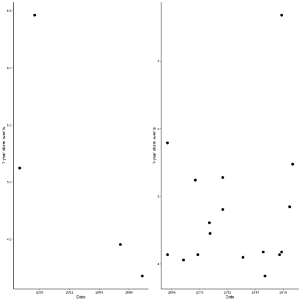
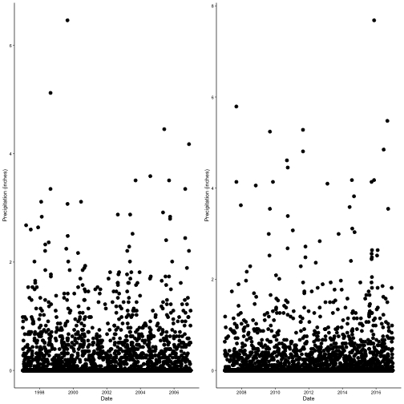

Climate Change effects on large storm events in Beaufort, NC
========================================================
author: Taro Katayama, Karen Thornton, Lambert Ngenzi
date: 04/11/22
autosize: true

Map of Beaufort
========================================================


```r
#insert map
```

Question and Hypothesis
========================================================
Question 1: Has there been a significant increase in precipitation in Beaufort, NC from 1980 to 2016? 

Question 2: Has there been a significant increase in 1-year precipitation event in Beaufort, NC from decade to decade (1997 to 2006 and 2007 to 2016)? 

Null Hypothesis 1: There is no significant change in precipitation from 1980 to 2016.

Null Hypothesis 2: There is no significant change in 1-year precipitation events from decade to decade (1997 to 2006 and 2007 to 2016). 

Data
========================================================
- Data from DAYMET, attained from Hydrology class 
- Historical precipitation data from Beaufort, NC


See column headers below

```
[1] "Date"           "Mean_Precip_mm" "year"           "month"         
[5] "day_of_month"  
```

Data Wrangling 
========================================================


- Grouped by month and year
- Mean and sum of precipitation attained

```r
Beaufort_Clean<- Beaufort_RAW%>%
  group_by(year,month)%>%
   summarise(meanmonthlyprecip= mean(Mean_Precip_mm),
             sumMonthlyPrecip= sum(Mean_Precip_mm))%>%
  mutate(Date= my(paste0(month,"-", year)))
```

Data Wrangling: Early decade
========================================================
- Convert from mm to inches
- Filtered the date to show first decade (1997 to 2007)
- Created column for "1-year precipitation events" (Threshold = 3.66 inches per day)

```r
Beaufort_early<- Beaufort_RAW%>%
  mutate(PrecipInches= Mean_Precip_mm*0.0394)%>%
  filter(Date >("1996-12-31"), Date < ("2007-01-01")) %>% 
  mutate(sigPrecip= ifelse(PrecipInches>3.66,PrecipInches,0),
         NumSigPrecip= ifelse(PrecipInches>3.66, 1,0))%>%
  select(Date , year, month, 
         day_of_month, PrecipInches, sigPrecip, NumSigPrecip)%>%
  drop_na()
```

Analysis of Data: Overall Precip
========================================================
- t-test using mean monthly precip
- Seasonal Mann Kendall (to look at trend without seasonality)


```

	One Sample t-test

data:  Beaufort_RAW$Mean_Precip_mm
t = 43.492, df = 13504, p-value < 2.2e-16
alternative hypothesis: true mean is not equal to 0
95 percent confidence interval:
 3.953508 4.326684
sample estimates:
mean of x 
 4.140096 
```

Analysis of Data: Overall Precip
========================================================
- t-test using mean monthly precip
- Seasonal Mann Kendall (to look at trend without seasonality)

```
tau = 0.0189, 2-sided pvalue =0.0056612
```


Analysis of Data: By Decades
========================================================
- t-test to compare precip by decade
- t-test to compare 1-year precip events by decade


```

	Welch Two Sample t-test

data:  Beaufort_early$PrecipInches and Beaufort_Late$PrecipInches
t = -0.64906, df = 7133.8, p-value = 0.5163
alternative hypothesis: true difference in means is not equal to 0
95 percent confidence interval:
 -0.02812072  0.01413102
sample estimates:
mean of x mean of y 
0.1627598 0.1697546 
```
Analysis of Data: By Decades
========================================================
- t-test to compare precip by decade
- t-test to compare 1-year precip events by decade

```

	Welch Two Sample t-test

data:  Beaufort_early$sigPrecip and Beaufort_Late$sigPrecip
t = -2.7068, df = 5451.7, p-value = 0.006815
alternative hypothesis: true difference in means is not equal to 0
95 percent confidence interval:
 -0.028681849 -0.004586864
sample estimates:
  mean of x   mean of y 
0.005537589 0.022171945 
```

Results: Overall
========================================================
- Significant Increase!


Results: Overall
========================================================
- No Significant Increase :(




Results: By Decade
========================================================
- Significant Increase!


Summary
========================================================

Large storm events = bad!

Climate Change = bad!

